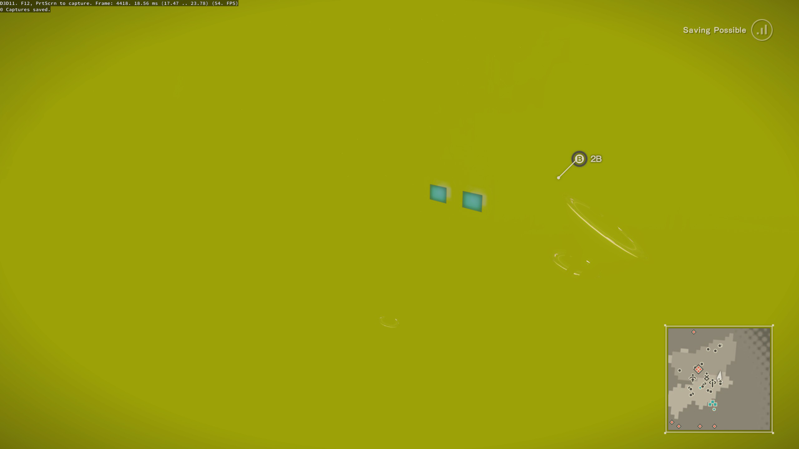
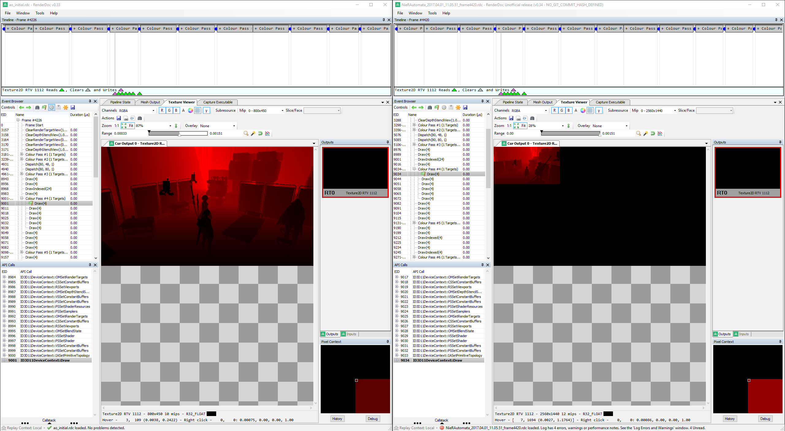
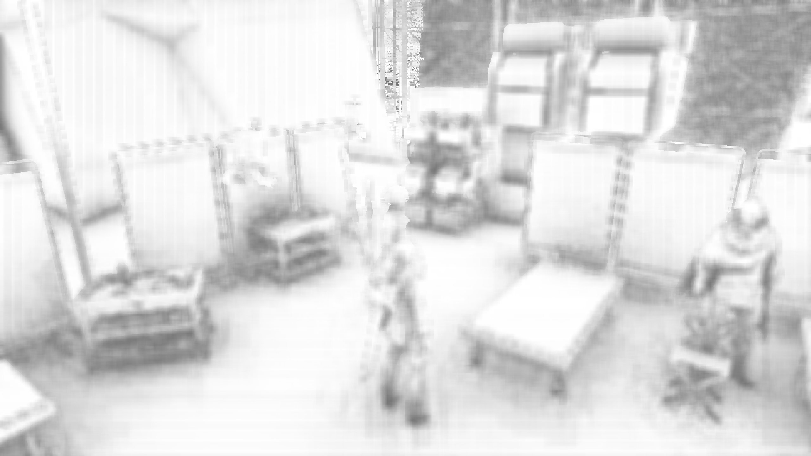
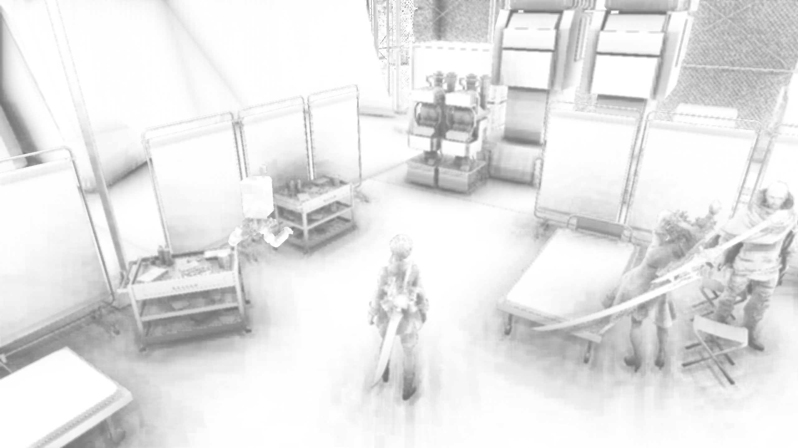

# Preamble

## What is this about?
This document is a tutorial for manipulating the rendering of a game (generally to increase its quality) if you only have a binary available. If yo uever wondered how something like DSFix, or DPFix, or many of my GeDoSaTo plugins work, then this is for you.

If you have ever thought it would be great if you could do something like that too, then even better, this is for you too. Hopefully it will save you a lot of time figuring out things that become second nature when you have been doing this for half a decade or so.

## Structure
There are 3 major sections in this document: "Preamble" (what you are reading right now), "Analysis", and "Manipulation". "Analysis" deals with figuring out what the game does and what we probably need to change, while "Manipulation" explains how to apply the actual changes. 

## Prerequisites
In this tutorial, we will be using this software:
* The *excellent* [RenderDoc](https://renderdoc.org/), which is a free graphics debugging tool that makes all of this **so much** easier than back when I was messign around with textual log files and image dumps.
* Visual Studio 2017 Community Edition, which is freely available from Microsoft.

In terms of foundational knowledge, to get the full benefit of this tutorial, it would probably be good to have:
* Basic knowledge of C++.
* An understanding of the fundamentals of 3D rendering.
* Some knowledge about Screen-Space Ambient Occlusion. 

## The game of coice
We will be dealing with Nier:Automata, because it is a great game and because it offers what I'd consider a "moderate" amount of challenge for the types of tasks we wish to perform. It also plays well with Renderdoc without any complicated coaxing. Of course, the tutorial should be equally applicable to a great many other games.

# Analysis

## Our goal
For the purpose of a tutorial (and for any type of work and modding really) it's important to have a very clear goal. Our **goal** for this exercise is to *increase the spatial rendering resolition* of the Ambient Occlusion effect in Nier:Automata. I arrived at this goal (like most my modding goals) by playing the game and seeing something I didn't like, image quality wise.

## A Reference Run of Renderdoc
To gain an understanding of how the game performs its rendering, we will run it from within Renderdoc and *capture a frame*.
This will allow us to investigate everything that happens which is related to rendering that particular frame. To do so, we need to point Renderdocat the game executable and launch it:

Then, in-game, we move to a location which should be a good place to judge the effect we want to manipulate, and capture a frame by pressing F12 (Renderdoc should show an in-game overlay which informs us of this shortcut). After exiting the game, Renderdoc will automatically load and show us the framedump in replay mode:

I won't give a full explanation of all the UI elements of Renderdoc. What is important for us now is that on the left, the *Event Browser* gives a chronological timeline of all rendering events, and that the *Texture Viewer* allows us to see the output of each rendering call. By opening the texture viewer and navigting downwards through the events, we should eventually reach something which looks like a raw ambient occlusion buffer. It is shown in the screenshot above. What we immediately see there is that it is a **800x450** buffer, despite our rendering resolution being a full 2560x1440. This is likely the primary culprit for the low quality we are seeing, and it is what we need to change.

## Gaining a better understanding

However, in order to understand everything we need to change, we also need to know which inputs this AO pass uses. Luckily, Renderdoc makes this rather easy:

We've switched to the *Inputs* tab on the right, and now see that we only have a single input. Just like our output, it's 800 by 450. Note that initially it would just be shown as a flat black area. This is often the case with floating point buffers, if their values don't fall into the ranges we can distinguish with the naked eye. As you can see in the highlighted part on top, we can manipulate the *Range* setting in Renderdoc to make the content visible. In this case, it clearly looks like a Z buffer (storing a depth value for each pixel), which is what we would expect as the minimum input to an SSAO pass.

Interestingly, we also see (at the bottom) that it is a texture with 10 mipmaps. Further investigation of the rendering passes using it as either a source or target reveals that the individual mip maps are populated just before the AO pass. Here it helps a lot to have read the Scalable Ambient Obscurance paper, since it explains how a hierarchical Z-buffer can be used to greatly speed up and reduce the memory overhead of large-scale AO computations.

Looking at the rendering calls right after the initial AO pass, we see a horizontal and vertical depth-dependent blur pass, which is also typical of most SSAO implementations.

## Summary

To summarize, our initial analysis tells us that:
* There are two 800x450 buffers involved. One is of the `R8G8B8A8_UNORM` format and stores the AO coverage, the other is of the `R32_FLOAT` format with mipmaps and stores a hierarchical Z buffer.
* In terms of rendering, first mipmap 0 of the R32 buffer is populated, and then subsequently smaller mipmaps are filled from larger ones.
* Then the actual AO pass is calculated.
* Finally, horizontal and vertical depth-dependent blur passes are performed.

We will refer to this Renderdoc frame capture as our *initial reference*, which we can use to look up what should really be happening in case something goes wrong (and it always does) once we start manipulating things.

# Manipulation

## Implementation framework
In order to manipulate the rendering of a game, we need to get our code running in its process, and we need to intercept and potentially change its 3D API calls. This is a huge and labor-intesive topic, and since this toturial focuses on how to understand and change the rendering process rather than technicalities of dll injection and hooking, I'll not go further into this.

What we wil lbe doing for our experiments is simply use Renderdoc as our vehicle of injection. This has the advantage of being a really solid and well-tested tool, which allows us to focus on figuring out what we need to do rather than why our toolset is not working for some conrner case. Of course, to actually create a meaningfully distributable and playable version, we need to port our final result into some injection framework designed for that purpose. 

## Buffers (the easy part)
The first thing we need to do in order to increase the rendering resolution is to actually make our buffers large enough to support that resolution. To do so, we change the `WrappedID3D11Device::CreateTexture2D` method in the Renderdoc sources:

```C++
HRESULT WrappedID3D11Device::CreateTexture2D(const D3D11_TEXTURE2D_DESC *pDesc,
                                             const D3D11_SUBRESOURCE_DATA *pInitialData,
                                             ID3D11Texture2D **ppTexture2D)
{
  // Desired AO resolution
  static UINT aoW = 1280; 
  static UINT aoH = 720;

  // 800x450 R8G8B8A8_UNORM is the buffer used to store the AO result and subsequently blur it
  // 800x450 R32_FLOAT is used to store hierarchical Z information (individual mipmap levels are rendered to)
  //                   and serves as input to the main AO pass
  if(pDesc->Format == DXGI_FORMAT_R8G8B8A8_UNORM || pDesc->Format == DXGI_FORMAT_R32_FLOAT) {
    if(pDesc->Width == 800 && pDesc->Height == 450) {
      // set to our display resolution instead
      D3D11_TEXTURE2D_DESC copy = *pDesc;
      copy.Width = aoW;
      copy.Height = aoH;
      pDesc = &copy;
    }
  }
  
  // [...]
}
```

The code is rather self-explanatory, the `[...]` part refers to the existing RenderDoc implementation of the method.

*Normally, at this point, I would also immediately look into other relevant and related things which need to be adapted, such as viewports, scissor rectanges and shader parameters.* However, for the tutorial, it's instructive to see what happens with just this change:



As you can see, what *does* happen is that our rendering breaks completely. This will probably always be a common result while you are developing something like this. So how do we deal with it? This is where our reference frame capture comes in and proves very useful.

Taking another capture and comparing it side-by-side with our reference, we can move forward until we see an issue occurring. Usually, it will be rather obvious, and so it is in this case:


As you can see, only a small part of our manipulated buffer is being used by the GPU. What you can't see in the screenshot but what is obvious when inspecting the subsequent draw calls in the trace file is that this error propagates across the individual mip map passes until basically nothing is left.

## Viewports and shader parameters
If you are used to these kinds of modding -- or after you've read this tutorial ;) -- you know that this is a very typical manifestation of a viewport setting and/or shader parameters not being adjusted correctly to match the new, larger buffer sizes.

What we need to investigate are the viewport settings for the relevant draw calls, as well as whether there are any shader parameters which seem to be derived from or dependent on the buffer resolution. We find the following for the main AO pass:

We see both a hardcoded 800x450 viewport setting as well as a very suspicious pixel shader constant buffer used in this draw call. For interpreting the first two values, some graphics background and/or experience is again extremely helpful. I immediately suspected that they were pixel sizes at the original input buffer resolution -- these are often supplied to shaders so that they can access neighbourhood values. And indeed, `1.0/1600 = 0.000625`, and the same holds true for the vertical resolution in the second component.

For all the other passes involved in this particular case the situation is very similar -- both the viewports and a related shader parameter need to be adjusted, and I won't go into detail for all of them. For the hierarchical Z passes, it is particularly important to make sure that the correct mip level being used as a rendertarget is identified.

## Setting those values
Actually adjusting the viewports and in particular the shader parameters is a bit tricky. There are multiple ways to go about it, and I wasted some time in avenues that did not pan out. Generally, there are at least these options:
- If a game uses a particular buffer exclusively for the given operation, try to adjust the values when it is filled (either at creation time or when it is mapped and written to)
- If the game reuses a buffer for multiple purposes, overwrite it before the draw call and restore its previous state afterwards.
- Completely replace the buffer with your own copy before the draw call happens.

When possible, I consider the first of these options to be the cleanest, but it did not work out for Nier in this case. The second one induces some ugly state management. The third requires you to manage the buffer lifetimes, but since we are talking about just a few floats here I considered that to be the most viable option.

The second decision to make is when to actually perform the adjustments, and how to detect that they need to be performed. Here, it generally pays off to keep a few factors in mind:
- The closer you are to the actual draw call, the less can go wrong in between.
- Keep the first few checks as fast as possible and quickly weed out commoon draw call patterns to keep the overhead minimal.
- It's better to do a bit too much checking than too little. Only touch what you really need to.
- Be very careful with DirectX API object reference counting. Even by just inspecting things to perform checks, you are very likely to increase some reference counts which need to be released again.

Following these principles, I arrived at this code:
```C++
void PreDraw(WrappedID3D11DeviceContext* context) {
  UINT numViewports = 0;
  context->RSGetViewports(&numViewports, NULL);
  if(numViewports == 1) {
    D3D11_VIEWPORT vp;
    context->RSGetViewports(&numViewports, &vp);

    if((vp.Width == 800 && vp.Height == 450)
        || (vp.Width == 400 && vp.Height == 225)
        || (vp.Width == 200 && vp.Height == 112)
        || (vp.Width == 100 && vp.Height == 56)
        || (vp.Width == 50 && vp.Height == 28)
        || (vp.Width == 25 && vp.Height == 14)) {

      ID3D11RenderTargetView *rtView = NULL;
      context->OMGetRenderTargets(1, &rtView, NULL);
      if(rtView) {
        D3D11_RENDER_TARGET_VIEW_DESC desc;
        rtView->GetDesc(&desc);
        if(desc.Format == desc.Format == DXGI_FORMAT_R8G8B8A8_UNORM || desc.Format == DXGI_FORMAT_R32_FLOAT) {
          ID3D11Resource *rt = NULL;
          rtView->GetResource(&rt);
          if(rt) {
            ID3D11Texture2D *rttex = NULL;
            rt->QueryInterface<ID3D11Texture2D>(&rttex);
            if(rttex) {
              D3D11_TEXTURE2D_DESC texdesc;
              rttex->GetDesc(&texdesc);
              if(texdesc.Width != vp.Width) {
                // Here we go!
                // Viewport is the easy part
                vp.Width = (float)texdesc.Width;
                vp.Height = (float)texdesc.Height;
                // if we are at mip slice N, divide by 2^N
                if(desc.Texture2D.MipSlice > 0) {
                  vp.Width = (float)(texdesc.Width >> desc.Texture2D.MipSlice);
                  vp.Height = (float)(texdesc.Height >> desc.Texture2D.MipSlice);
                }
                context->RSSetViewports(1, &vp);

                // The constant buffer is a bit more difficult
                // We don't want to create a new buffer every frame,
                // but we also can't use the game's because they are read-only
                // this just-in-time initialized map is a rather ugly solution,
                // but it works as long as the game only renders from 1 thread (which it does)
                // NOTE: rather than storing them statically here (basically a global) the lifetime should probably be managed
                D3D11_BUFFER_DESC buffdesc;
                buffdesc.ByteWidth = 16;
                buffdesc.Usage = D3D11_USAGE_IMMUTABLE;
                buffdesc.BindFlags = D3D11_BIND_CONSTANT_BUFFER;
                buffdesc.CPUAccessFlags = 0;
                buffdesc.MiscFlags = 0;
                buffdesc.StructureByteStride = 16;
                D3D11_SUBRESOURCE_DATA initialdata;
                ID3D11Buffer* replacementbuffer = NULL;
                ID3D11Device* dev = NULL;

                // If we are not rendering to a mip map for hierarchical Z, the format is 
                // [ 0.5f / W, 0.5f / H, W, H ] (half-pixel size and total dimensions)
                if(desc.Texture2D.MipSlice == 0) {
                  static std::map<UINT, ID3D11Buffer*> buffers;
                  auto iter = buffers.find(texdesc.Width);
                  if(iter == buffers.cend()) {
                    float constants[4] = {0.5f / vp.Width, 0.5f / vp.Height, (float)vp.Width, (float)vp.Height};
                    initialdata.pSysMem = constants;
                    context->GetDevice(&dev);
                    dev->CreateBuffer(&buffdesc, &initialdata, &replacementbuffer);
                    buffers[texdesc.Width] = replacementbuffer;
                  }
                  context->PSSetConstantBuffers(12, 1, &buffers[texdesc.Width]);
                }
                // For hierarchical Z mips, the format is
                // [ W, H, LOD (Mip-1), 0.0f ]
                else {
                  static std::map<UINT, ID3D11Buffer*> mipBuffers;
                  auto iter = mipBuffers.find(desc.Texture2D.MipSlice);
                  if(iter == mipBuffers.cend()) {
                    float constants[4] = {vp.Width, vp.Height, (float)desc.Texture2D.MipSlice-1, 0.0f};
                    initialdata.pSysMem = constants;
                    context->GetDevice(&dev);
                    dev->CreateBuffer(&buffdesc, &initialdata, &replacementbuffer);
                    mipBuffers[texdesc.Width] = replacementbuffer;
                  }
                  context->PSSetConstantBuffers(8, 1, &mipBuffers[texdesc.Width]);
                }
                if(dev) dev->Release();
              }
            }
            rt->Release();
          }
        }
        rtView->Release();
      }
    }
  }
}

void WrappedID3D11DeviceContext::Draw(UINT VertexCount, UINT StartVertexLocation)
{
	if(VertexCount == 4 && StartVertexLocation == 0) PreDraw(this);
  
  // [...]
}
```
As you can see, it's a bit cumbersome to make sure we are only touching exactly what we want to touch, but it's really more *lengthy* than complicated. Basically, for every draw call fitting the pattern (4 vertices, 1 target, specific formats, specific sizes), we check whether our rendertarget texture has a different size than the currently set viewport, and if so we adjust the viewport and set a new constant buffer in the corresponding slot.

## Final result cleanup
With these changes, we now get working higher-resolution ambient occlusion:


It's still a bit artifacted, and could be even better, but it's a pretty huge improvement.

However, our final frame -- that is, the actual game output -- is still completely broken. To fix this, we need to get back to our reference comparison. That way, we can determine that there is another depth/stencil buffer which needs to be adjusted to match our new AO buffer sizes, otherwise the API will (rightfully) refuse to do any rendering later on in the frame.
